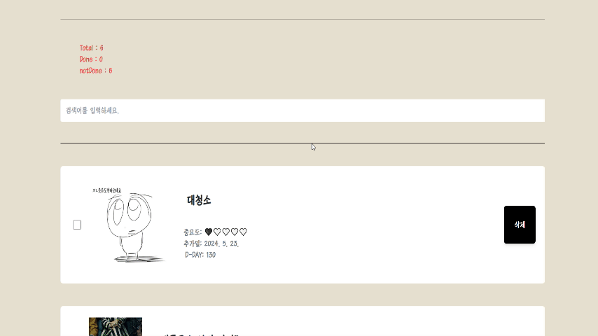
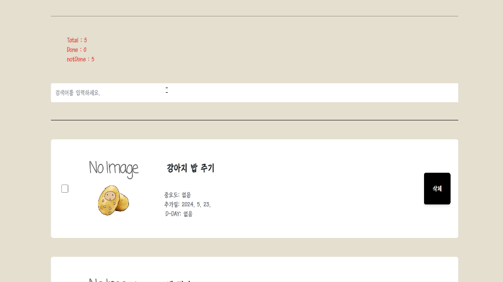

## 🛸 사이트 링크
[To Do List](https://isangslist.netlify.app/)
<br/>
<br/>
## 📆 프로젝트 기간
2024/05/22~2024/05/23
<br/>
<br/>
## 🎁 기획의도 및 기대효과
할 일을 관리하고 추적하는데 도움을 주기위해 만들었습니다. 중요도와 D-DAY를 통해 쉽게 우선순위를 정하고 사진으로 동기부여를 주기 때문에 목표를 빨리 달성하고 성취감을 얻을 것으로 예상됩니다.
<br/>
<br/>

## 🎈 서비스 기능
#### 메인 화면


#### 할 일 추가

```
내용을 입력하고 사진을 추가할 수 있으며 기간과 중요도 설정이 가능합니다.
기간을 설정할 경우 D-day가 나타납니다.
```


```
다른 조건을 설정하지 않을 때, 이미지는 기본 이미지가 들어가며 기간과 중요도는 '없음'으로 나타납니다. 
```
#### 할 일 체크


```
할 일을 체크하면 내용에 줄이 그어지며 우선순위가 낮아지기 때문에 맨 밑으로 내려갑니다. 
취소할 경우 우선순위가 다시 높아지기 때문에 맨 위로 올라옵니다.
done 과 notDone으로 한 일과 하지 않은 일의 갯수가 자동으로 변경됩니다.
```
#### 할 일 삭제


```
삭제 버튼을 누르면 삭제됩니다.
```
#### 검색

```
검색을 하면 해당 할 일이 나옵니다. 
```

## 🛠 사용한 기술스택
- React
- Tailwind CSS
- Bootstrap CSS
<br/>
<br/>

## 💻프로젝트 구조

```
📦src
 ┣ 📂assets
 ┃ ┣ 📜case.jpg
 ┃ ┣ 📜doggy.jpg
 ┃ ┣ 📜icecream.jpg
 ┃ ┣ 📜potato.png
 ┃ ┣ 📜react.svg
 ┃ ┗ 📜todoLogo.png
 ┣ 📂components
 ┃ ┣ 📜Button.jsx
 ┃ ┣ 📜Editor.jsx
 ┃ ┣ 📜Footer.jsx
 ┃ ┣ 📜Header.jsx
 ┃ ┣ 📜List.jsx
 ┃ ┗ 📜TodoItem.jsx
 ┣ 📂pages
 ┃ ┣ 📜CalendarPage.css
 ┃ ┣ 📜CalendarPage.jsx
 ┃ ┗ 📜Test.jsx
 ┣ 📜App.jsx
 ┣ 📜index.css
 ┗ 📜main.jsx
```

